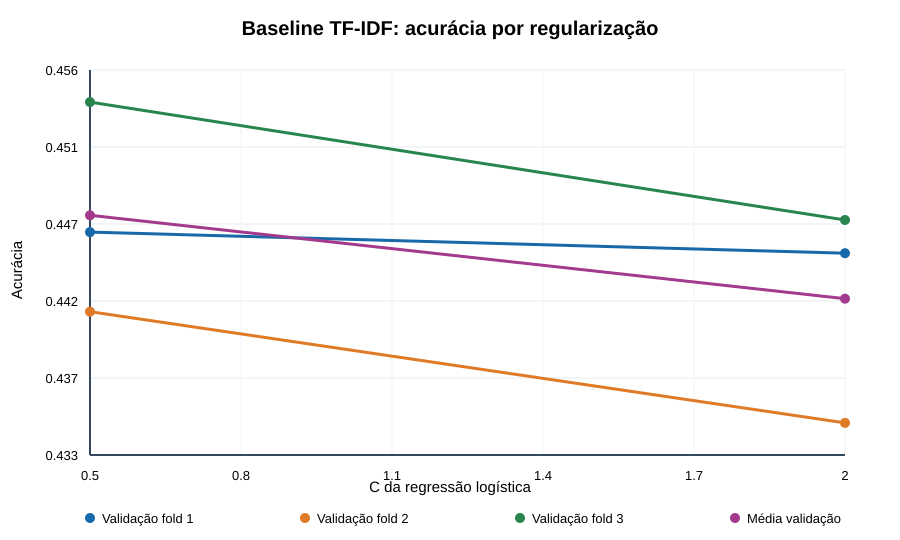

# Etapa 2 — referências e instrumentação

**Execução:** `baseline_20260924_1724` em 24/09/2026, comando `python src/run_baseline.py --run-id baseline_20260924_1724`. Fonte `train.xlsx` SHA-256 `0e9219233664ac675fc47982bbc822acd3bb15d67fb7bfc26b67bec047e46818`; divisão `grouped_v1_seed_20260924` da Etapa 1. Semente 20260924, scikit-learn 1.7.2, CPU com limite de quatro threads. Tempo total de parede: **28,842 s**; GPU não usada. As métricas completas, configurações, tempos e caminhos dos seis checkpoints estão em `runs/etapa2/baseline_20260924_1724/metrics.json`.

## Protocolo

Foram usados os três folds agrupados de desenvolvimento. Em cada fold, a classe majoritária foi calculada apenas nas linhas de treino. O `TfidfVectorizer` também foi ajustado somente nelas e aplicado à validação correspondente. O texto fornecido à vetorização é o texto original da planilha; apenas a única célula numérica foi convertida por `str()`, conforme a Etapa 1. O TF-IDF usa seus próprios parâmetros explícitos: palavras, unigramas e bigramas, `min_df=3`, no máximo 100.000 termos, `sublinear_tf=True`, normalização L2 e `lowercase=True`. O vocabulário aprendido variou de 72.114 a 73.040 termos por fold.

A busca foi limitada a `C=0,5` e `C=2,0` para `LogisticRegression(solver='lbfgs', max_iter=400)`. A vetorização foi compartilhada entre os dois valores de `C` dentro de cada fold, sempre sem usar linhas de validação no ajuste. A validação final reservada de 3.024 linhas **não foi avaliada**.

## Resultados

| Referência | Fold 1 | Fold 2 | Fold 3 | Média de acurácia | Desvio entre folds | Macro-F1 médio | Acurácia média no treino |
| --- | ---: | ---: | ---: | ---: | ---: | ---: | ---: |
| Classe majoritária | 33,87% | 34,11% | 33,30% | **33,76%** | — | 16,83% | — |
| TF-IDF + regressão, `C=0,5` | 44,61% | 44,13% | 45,38% | **44,71%** | 0,63 p.p. | **44,45%** | 71,48% |
| TF-IDF + regressão, `C=2,0` | 44,48% | 43,48% | 44,68% | **44,21%** | 0,64 p.p. | 44,10% | 84,53% |

`C=0,5` foi escolhido para representar o baseline nas próximas comparações porque apresentou maior acurácia média de validação. Sua vantagem sobre a classe majoritária foi **10,94 pontos percentuais**. O aumento de `C` elevou muito a acurácia de treino e reduziu a de validação, evidenciando maior sobreajuste. Mesmo com `C=0,5`, a diferença entre as médias de treino e validação foi de 26,78 pontos percentuais. Não houve avisos de falta de convergência.

O gráfico foi gerado pelo utilitário genérico `src/plot_curves.py`, que recebe séries numéricas em JSON e poderá ser reutilizado para curvas de treino e validação do BERT. A especificação desta curva está em `runs/etapa2/baseline_20260924_1724/curve.json`.

### Desempenho por classe de `C=0,5`

| Classe real | Recall médio nos folds |
| --- | ---: |
| `c1` | 41,64% |
| `c234` | 37,45% |
| `c5` | 54,72% |

Matriz de confusão somada nas três validações internas; linhas são classes reais e colunas são predições, na ordem `c1`, `c234`, `c5`:

| Real \\ predito | `c1` | `c234` | `c5` |
| --- | ---: | ---: | ---: |
| `c1` | 2.251 | 1.665 | 1.479 |
| `c234` | 1.552 | 2.177 | 2.088 |
| `c5` | 960 | 1.692 | 3.204 |

A classe `c234` teve o menor recall e se confundiu com ambas as classes extremas. As linhas repetidas com avaliações conflitantes, registradas na Etapa 1, permanecem no treino e na avaliação; a contribuição isolada delas para o erro ainda não foi medida.

## Reprodutibilidade e limites

O arquivo `configs/baseline.json` fixa os parâmetros; `data/splits_grouped_v1.json` fixa os índices. A execução gerou seis checkpoints em `models/baseline/baseline_20260924_1724/`, um para cada par fold/`C`. O checkpoint do fold 1 com `C=0,5` foi recarregado e produziu previsões válidas em cinco linhas de sua validação. O tempo de ajuste dos três classificadores com `C=0,5` somou 4,535 s; a vetorização de cada fold levou 3,105–3,387 s, além do tempo de predição, serialização e leitura incluído no total de parede.

O resultado histórico de aproximadamente 46% não tem protocolo de divisão confirmado e **não é diretamente comparável** aos 44,71% medidos aqui. Estes números são dos folds de desenvolvimento e não representam desempenho no teste nem na validação final. O baseline serve como referência fixa para as próximas etapas; nenhuma configuração de BERT foi executada nesta etapa.
