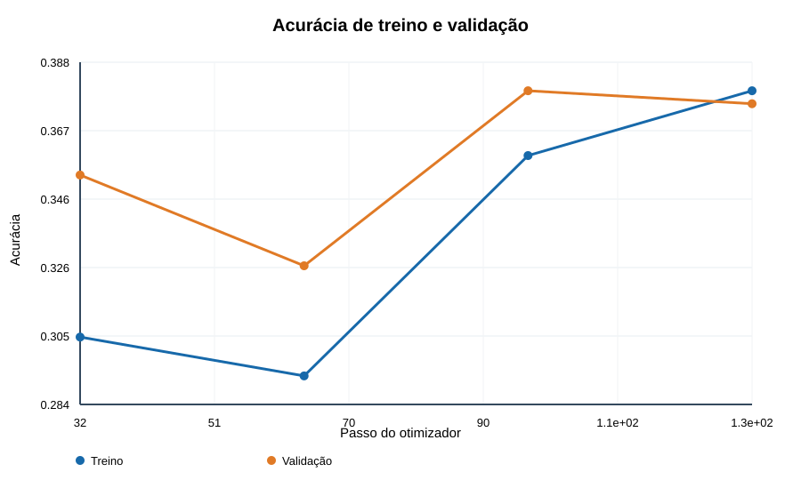
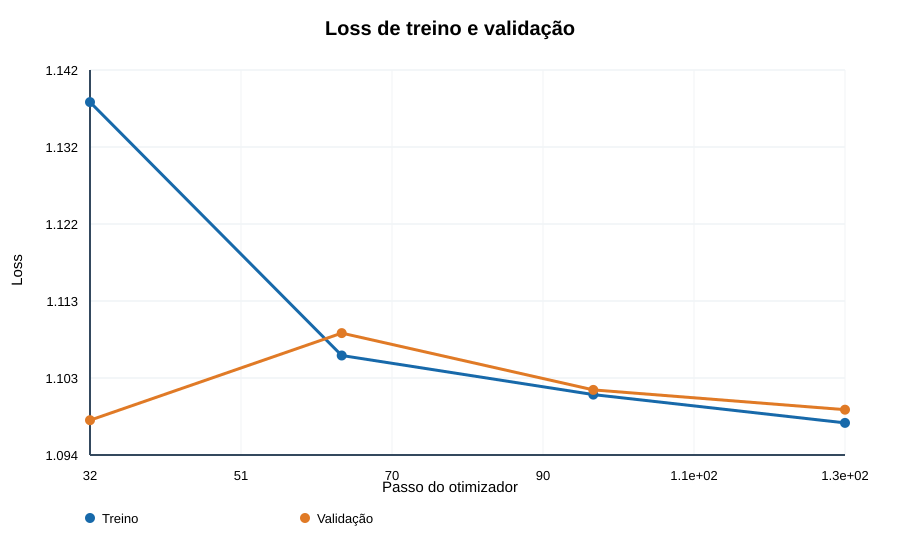

# Etapa 3 — BERTimbau mínimo e custo medido

**Data:** 24/09/2026. **Modelo:** `neuralmind/bert-base-portuguese-cased`, BERTimbau Base com cabeça nova de classificação para `c1`, `c234`, `c5`. **Fonte:** `train.xlsx` SHA-256 `0e9219233664ac675fc47982bbc822acd3bb15d67fb7bfc26b67bec047e46818`. **Divisão:** `grouped_v1_seed_20260924`, somente fold 1 de desenvolvimento. A validação final reservada não foi acessada.

## Implementação

O comando `python src/bert_stage3.py benchmark` mede 12 microbatches. O comando `python src/bert_stage3.py short` faz uma execução curta com subconjuntos fixos do fold 1. A configuração completa está em `configs/bert_stage3.json`, com semente 20260924, texto original da planilha, comprimento máximo de 256 tokens, padding dinâmico por lote, microbatch de 2, acumulação de gradiente de 4 (lote efetivo 8), AdamW com taxa de aprendizado `2e-5` e `weight_decay=0,01`. A única célula numérica de `resp_text` é convertida por `str()`, como na Etapa 1. Nenhum texto foi normalizado com a chave usada para formar grupos.

A escolha inicial de 256 tokens foi feita como teste de capacidade: a Etapa 1 mediu que 7.204 de 20.092 respostas excedem esse tamanho. Portanto, esta janela trunca cerca de 35,86% das entradas. A comparação de representações e comprimentos pertence à Etapa 4.

## Execuções e custo

| Execução | Dados | Passos | Tempo | Pico alocado / reservado | Resultado |
| --- | --- | ---: | ---: | ---: | --- |
| `bert_stage3_benchmark_20260924_1748` | 96 linhas amostradas, 24 usadas em 12 microbatches | 3 do otimizador | 2,715 s de treino; 4,503 s total | 2,366 / 2,573 GB | forward, backward e atualizações concluídos |
| `bert_stage3_short_20260924_1753` | 1.024 linhas de treino, 512 de validação, amostradas do fold 1 | 128 do otimizador, uma passagem pelo subconjunto | 118,324 s de treino e avaliações; 121,914 s total | 2,370 / 2,603 GB | melhor checkpoint no passo 96 |

Na execução curta, a média sincronizada foi **0,1341 s por microbatch**, com **8,654 exemplos/s** considerando treino e avaliações. A avaliação das 512 linhas levou cerca de 12 s em cada ponto. A partir dos microbatches da execução curta, uma passagem de treino pelas 11.488 linhas do fold 1 levaria aproximadamente **770 s (12,8 min)** nas mesmas condições, antes de avaliações, salvamentos e leitura de dados. Essa é uma projeção de custo, não um tempo medido em um fold inteiro. A memória observada deixa folga na GPU de 8 GiB para este lote e comprimento, mas isso não comprova que lotes ou sequências maiores caberão.

## Curvas e checkpoint

| Passo | Loss treino desde a avaliação anterior | Acurácia treino no intervalo | Loss validação | Acurácia validação | Macro-F1 validação |
| --- | ---: | ---: | ---: | ---: | ---: |
| 32 | 1,1377 | 30,47% | 1,0979 | 35,35% | 27,93% |
| 64 | 1,1060 | 29,30% | 1,1088 | 32,62% | 25,64% |
| 96 | 1,1011 | 35,94% | 1,1017 | **37,89%** | **29,34%** |
| 128 | 1,0976 | 37,89% | 1,0992 | 37,50% | 25,17% |

Early stopping estava habilitado com paciência de duas avaliações sem melhora, mas não foi acionado; os 128 passos planejados foram concluídos. O melhor checkpoint, escolhido por acurácia de validação e macro-F1 como desempate, está em `models/bert_stage3/bert_stage3_short_20260924_1753/best/`. Pesos, configuração de classes e tokenizer foram salvos e recarregados. Em cinco exemplos de validação, a recarga produziu logits finitos com forma `[5,3]` e somente classes válidas.

No melhor passo, o modelo não previu `c1` em nenhuma das 512 linhas de validação; os recalls foram 0% para `c1`, 47,25% para `c234` e 58,38% para `c5`. Isso reforça que a corrida curta ainda está subtreinada e serve para validar custo e funcionamento, não para escolher o modelo final.

As métricas completas e o histórico por avaliação estão em `runs/etapa3/bert_stage3_benchmark_20260924_1748/metrics.json` e `runs/etapa3/bert_stage3_short_20260924_1753/metrics.json`. O desempenho de **37,89%** é de uma execução de custo em apenas 1.024 exemplos; não é comparável aos **44,71%** do TF-IDF treinado nos folds completos e não serve para escolher hiperparâmetros finais.

## Limitação observada no ambiente

Dentro do isolamento de comandos do Codex, até operações simples da GPU passaram a falhar com `hipErrorInvalidImage` antes do primeiro forward do BERT. A tentativa falha foi preservada em `runs/etapa3/bert_stage3_benchmark_20260924_1742/failure.json`. O mesmo benchmark e a corrida curta concluíram normalmente fora desse isolamento. O PyTorch emitiu avisos de que as variantes de atenção eficiente na GPU AMD são experimentais; não foram habilitadas explicitamente. Para esta máquina, comandos de treino com ROCm precisam ser executados fora do isolamento do Codex. O fine-tuning mostrou-se funcional e a trilha alternativa de embeddings congelados não foi necessária nesta etapa.
